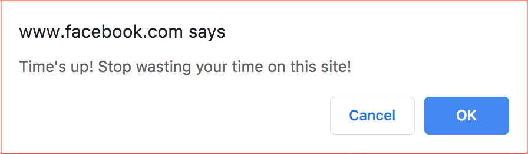
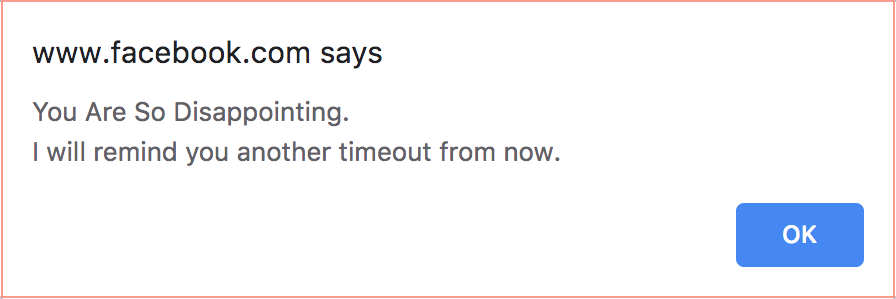

<p align="center">
  <a href=#>
    
  </a>
  <h2 align="center">Webaholic Reminder</h2>
  <h6 align="center">––––– Chrome Extension –––––</h2>
	<div align="center">
		Remind you to work when you spend too much time on the internet.
	</div>
	<div align="center">
		Currently available on <a href="https://chrome.google.com/webstore/detail/webaholic-reminder/ilidphpahmdlgjlcejdjhbeodnjhdhbb">Chrome Web Store</a>.
	</div>
</p>


## Table of contents
* [Application Demo](#application-demo)
* [Introduction](#introduction)
* [Getting Started](#getting-started)
* [Acknowledgments](#acknowledgments)

## Application Demo
### [Webaholic Reminder – Demo (YouTube)](https://youtu.be/vVIrdPcOeY0)
<p align="center">
<a href=https://www.youtube.com/watch?v=vVIrdPcOeY0>
    
</a>
</p>

## Introduction
Are you a [Webaholic](https://www.urbandictionary.com/define.php?term=webaholic)?  
If the answer is yes, this extension will help you quit "web-addiction" by two steps:

* Set Sites & Timeout
* Annoying Reminding

### Set Sites & Timeout
* Set sites you are addicted to in [regex expression](https://developer.mozilla.org/en-US/docs/Web/JavaScript/Guide/Regular_Expressions) (ex:  `youtube.com`, `reddit`, `https://facebook.com/*`)
* Set timeout and idle time
* Extension will count the time you spend on site if current url match the regex you set
* Timer will pause if you go idle after "Idle Time"

<p align="center">
    
</p>

**＊＊＊ Important ＊＊＊**

* All settings (including ON-OFF switch) will only apply to new page (including reload)
* Existed page comply with old settings
* Disambiguation - If browser "load" a page after setting, it is a new page

### Annoying Reminding
* Extension will remind you on "Timeout"
* You've got to choose stop wasting time or not

<p align="center">
    
</p>

* If you click "Cancel", extension will remind you after another timeout

<p align="center">
    
</p>

* If you click "OK", extension will close the tab for you

<p align="center">
    
</p>

## Getting Started

### For User

* Just click [HERE](https://chrome.google.com/webstore/detail/webaholic-reminder/ilidphpahmdlgjlcejdjhbeodnjhdhbb) to install it


### For Developer

* Clone the repo
 
```sh
git clone https://github.com/wenyalintw/Webaholic-Reminder.git
```

* Go to `chrome://extensions/` and click `Load unpacked` to load `/src`
* Play around with the code ⇄ reload

## Acknowledgments
* Timing function borrow and modified from [jasonzissman's repo: TimeMe.js](https://github.com/jasonzissman/TimeMe.js/)
* Reference of apperance design - [Adblock Plus](https://chrome.google.com/webstore/detail/adblock-plus-free-ad-bloc/cfhdojbkjhnklbpkdaibdccddilifddb) / [Google Translate](https://chrome.google.com/webstore/detail/google-translate/aapbdbdomjkkjkaonfhkkikfgjllcleb) / [FREE FRONTEND](https://freefrontend.com/css-input-text/) / [FVM](https://www.fabriziovanmarciano.com/button-styles/) / [CodePen](https://codepen.io/leoespsanto/pen/pEftw)

###### MIT License (2019), Wen-Ya Lin